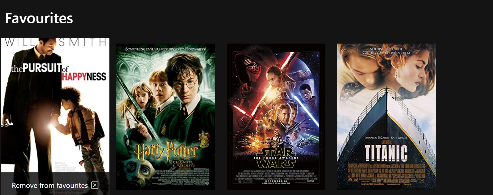

# Movie App
# First section contains the search bar and displays the list of movies
 
 
 # Second section contains the favourites 
 

# Description
This project enables you to get movie results as you type in search box , it offers you to add movies to you the favourites section and you can also delete them.
i used fetch to call the OMDb API , i used useState and usesEffect to make it all dynamic , i also used the local storage to save the liste of movies added to the favourites section. 
 